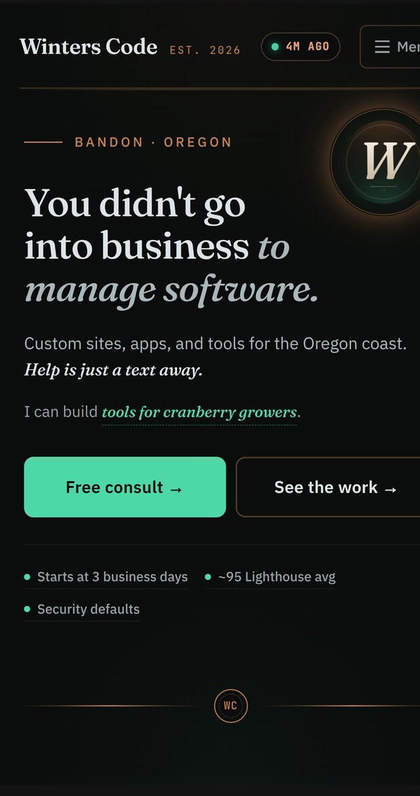

# Winters Code

Marketing site for [Winters Code](https://winterscode.com), [Preston Winters](https://winterscode.com)' solo software shop in Bandon, Oregon. Custom websites, apps, and tools for Oregon coast businesses.

**Live:** [winterscode.com](https://winterscode.com)

<p align="center">
  
</p>

[](https://winterscode.com)
[](https://astro.build/)
[](https://pages.cloudflare.com/)
[](LICENSE)

---

## What this is

The marketing site for a solo software shop in Bandon, Oregon. Built to demonstrate the work rather than describe it. The site itself is the portfolio piece: live deploy data on the homepage, real-time Lighthouse and security audits, an in-page audit tool that runs PageSpeed against any URL, and a memory-active chat instrument powered by an open-source engine.

Built for two audiences at once:

- **Local small business owners** scanning on phones, deciding whether to call. Sub-second loads on rural LTE, single-tap CTAs, no telemarketer copy.
- **Technical evaluators** opening DevTools to judge the build quality. Lighthouse 95+ mobile, A+ security headers, zero external JS on the homepage, all data sources are real and queryable.

## Stack

| Layer | Choice | Why |
|---|---|---|
| Framework | Astro 6 | Zero-JS by default, partial hydration for interactive islands |
| Styling | Tailwind v4 with `@theme` design tokens | No JS config, tokens are utilities the moment they exist |
| Islands | React 19 | For the chat demo, morphing hero phrase, mobile menu |
| Hosting | Cloudflare Pages | Edge runtime, global CDN, sub-50ms TTFB |
| Live data | Cloudflare Worker aggregating GitHub Events + PageSpeed Insights + Mozilla Observatory + Cal.com | Real numbers, cached at 3 tiers (memory → KV → fallback) |
| Type safety | TypeScript strict | End-to-end |

## Live performance

Lighthouse, mobile profile, real device:

| Metric | Score |
|---|---|
| Performance | 95+ |
| Accessibility | 100 |
| Best Practices | 100 |
| SEO | 100 |

Security headers grade A+ (Mozilla Observatory). HSTS, strict CSP per-page, X-Frame-Options, Referrer-Policy, Permissions-Policy. Audit it yourself at [observatory.mozilla.org](https://developer.mozilla.org/en-US/observatory/analyze?host=winterscode.com).

## Architecture

```
src/
├── layouts/
│   └── BaseLayout.astro      # head meta, fonts, schema.org, scroll progress
├── components/
│   ├── layout/               # sitewide chrome (Header, Footer, MobileMenu)
│   ├── sections/             # homepage sections (Hero, Apps, Sites, FAQ)
│   ├── ui/                   # atomic primitives (Button, Card, Divider)
│   └── islands/              # React components requiring hydration
├── pages/
│   ├── index.astro           # homepage
│   ├── work.astro            # portfolio with live interactive widgets
│   ├── services.astro        # what I build
│   ├── about.astro           # who I am
│   ├── contact.astro         # how to reach me
│   ├── audit.astro           # free in-page site audit tool
│   ├── privacy.astro         # privacy policy
│   ├── terms.astro           # terms of service
│   ├── 404.astro             # not-found
│   └── api/
│       ├── workshop.ts       # live workshop status (deploys, Lighthouse, etc.)
│       └── audit.ts          # PageSpeed audit for any URL
├── lib/
│   └── portfolio.ts          # portfolio data, single source of truth
└── styles/
    └── global.css            # design tokens, base styles, sitewide effects
```

## Design tokens

All color, typography, and spacing tokens live in `src/styles/global.css` under `@theme`. Tailwind v4 turns them into utilities automatically (`bg-bg-deep`, `text-wc-green`, `font-serif`). Adding a token in CSS makes the utility available immediately, no config rebuild.

Palette is editorial + workshop: deep ash background, copper hairline accents, mint green primary action, mono numerals for data, serif for emotion.

| Token | Hex | Purpose |
|---|---|---|
| `bg-deep` | `#0a0d0c` | Page background |
| `bg-stone` / `bg-card` / `bg-raised` | `#11151a` / `#161b1f` / `#1d2429` | Surfaces |
| `wc-green` / `wc-green-bright` | `#4dd8a8` / `#5fe8b5` | Primary accent |
| `copper` / `copper-bright` / `copper-deep` | `#c8804a` / `#e09665` / `#8a5430` | Secondary accent |
| `ash-100` to `ash-700` | Cool gray scale | Text and borders |

Fonts: Fraunces (display serif), IBM Plex Sans (body), JetBrains Mono (mono).

## Development

```bash
npm install        # install deps
npm run dev        # local dev server (Astro Vite, hot reload)
npm run build      # static build to dist/
npm run preview    # preview production build locally
```

Node 22+ required.

## Deployment

Cloudflare Pages, project `winterscode`. DNS managed via Cloudflare (zone `winterscode.com`). Worker secrets set via `wrangler secret put` and never committed.

## Credit

Built by Preston Winters at Winters Code, Bandon Oregon. Custom sites, apps, and tools for Oregon coast businesses.

- Live site: [winterscode.com](https://winterscode.com)
- Free site audit tool: [winterscode.com/audit](https://winterscode.com/audit)
- Book a consult: [winterscode.com/contact](https://winterscode.com/contact)
- Email: [preston@winterscode.com](mailto:preston@winterscode.com)

## Other work

- **[Sogn Contracting](https://github.com/Preston2012/Sogncontracting)** - production site for a Bandon general contractor, built same week
- **[Baseline](https://github.com/Preston2012/baseline.marketing)** - political intelligence platform marketing site
- **[Baseline showcase](https://github.com/Preston2012/baseline-showcase)** - architecture and Flutter code for the Baseline app
- **[Demiurge](https://github.com/Preston2012/demi)** - open-source AI memory engine
- **[trading-toolkit](https://github.com/Preston2012/trading-toolkit)** - Python automation, options scanner, trading bots

## License

MIT. See [LICENSE](LICENSE).

The code is open source. The "Winters Code" name and logo are property of Preston Winters and not covered by this license.
